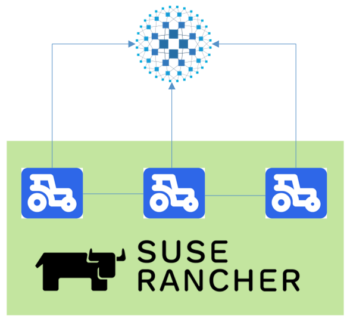

# Terraform script for RKE2 Infrastructure and Rancher on vSphere



This repo creates the following:

* 1x HAproxy Loadbalancer
* 3x RKE2 Nodes leveraging Embedded HA, forming a K8s Cluster
* Installation of `Cert-Manager` and `Rancher` 

# Prerequisites

* Prior to running this script, a DNS record needs to be created to point at the Loadbalancer IP address, defined in the variable `lb_address`.

* The VM template used must have the `Cloud-Init Datasource for VMware GuestInfo` project installed, which facilitates pulling meta, user, and vendor data from VMware vSphere's GuestInfo interface. This can be achieved with:

```
curl -sSL https://raw.githubusercontent.com/vmware/cloud-init-vmware-guestinfo/master/install.sh | sh -
```

`sshpass` must be installed on the provisioning machine

# Instructions

* Copy `terraform.tfvars.example` as `terraform.tfvars`
* Populate as you see fit
* Initialize the providers with  `terraform init`
* Apply with `terraform apply --var-file variables.tfvars`
* Once comple, Terraform will output the URL for Rancher, IE:

```
Apply complete! Resources: 9 added, 0 changed, 0 destroyed.

Outputs:

rancher_url = https://rancher.lab.k8
```

# Caveats

The `rancher_hostname` value must be a hostname that exists and is reachable by the provisioning machine. At time of writing, this had to point to an internal address provided by an internal DNS server. There was an existing DNS zone for cloudfare.dev, with no record for the `rancher_hostname` value, so the `terraform apply` failed at the helm stage

When creating a new cluster, after a previous one has been destroyed, it is necessary to remove the key in `~/.ssh/known_hosts`, e.g.:

```bash
$ ssh-keygen -f "~/.ssh/known_hosts" -R "10.120.54.139"
```
...otherwise the subsequent  provisioning process will fail, as a completely new node has been provisioned